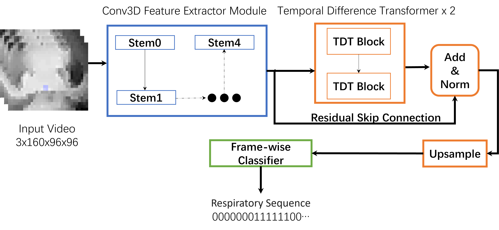
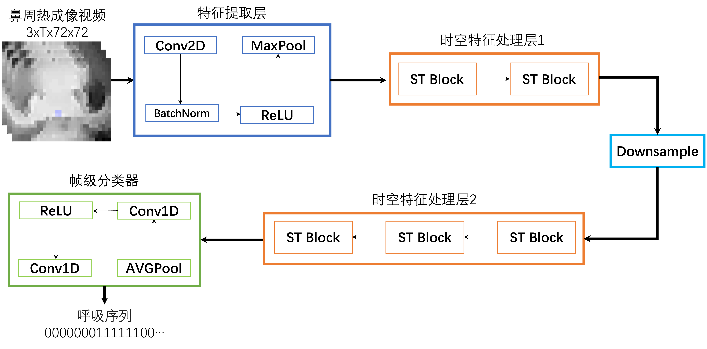
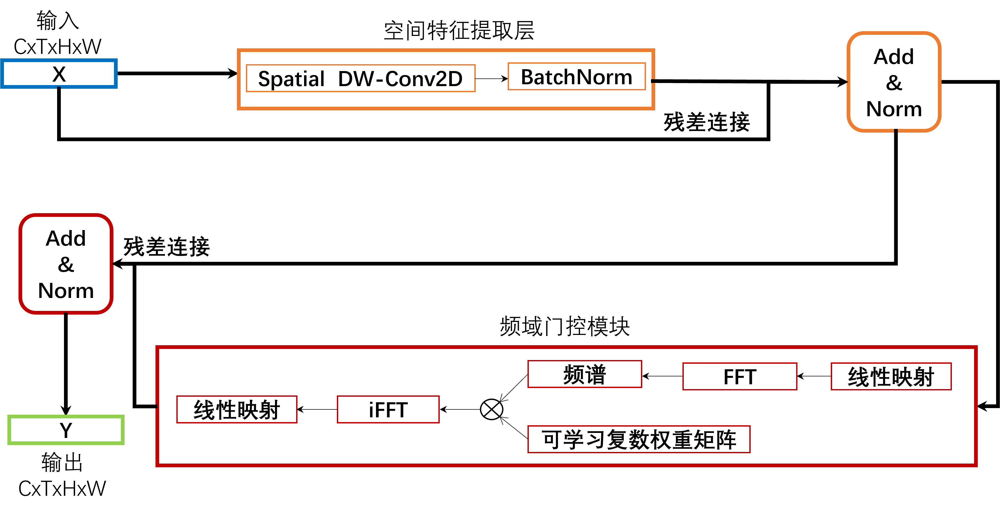

# ThermRNet
A model for estimating respiratory rate from thermal videos.

Demo Video:

ThermRNetv1  
ThermRNet: Deep Spatiotemporal Learning for Non-Contact Respiratory Rate Estimation via Infrared Thermography
https://dl.acm.org/doi/10.1145/3748382.3748387  
Overall architecture of ThermRNet
  

ThermRNetv2
Overall architecture of ThermRNet  
  
Spatio-Temporal Block  
  